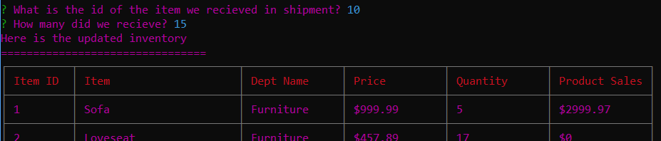

# Bamazon: Three CLI applications

# Getting Prepared

In order to run this application you will need MySql and node.js.
You can find those resources by following these links:
    -https://nodejs.org/en/
    -https://www.mysql.com/downloads/

First you must clone down the repo, next you will need to enter the command 'npm install' to install the various node modules used for this application.

Set up your mysql server and enter the required information into the connection section of each javascript file

;

Once that is done you must run the mySql scripts found in the bamazon_db and then the bamazon_seeds files.

This will create the database and fill it with some initial data.  If you have data of your own replace the seeds file with that data instead.

With that done you are ready to use the three different node apps.

# Bamazon Customer

This application represents the way in which a customer is able to interact.

They have the option to purchase an item at a desired quantity.  When the app loads it prints out the items from the products table of the database as well as the relevant information for the customer.  

Then the app asks the user to enter the item ID of the item they wish to purchase and how much of that item they wish to purchase.

If the transaction is possible then the application lets them know of the total cost of the transaction and updates the database accordingly.

If the transaction is not possible then the application alerts the user that we do not have enough in stock for that purchase.

# Bamazon Manager

This application represents the way the product manager would interact with the database.

They have the option to view the current inventory, add a new product to the inventory, increase the stock of a current item, and view items with a low stock quantity.

When viewing the current inventory or the low quanity inventory the application prints out a table with either all the items in stock (for current inventory) or only items of which we have fewer than 5 items (for low-stock).

When the user selects to add a new product the application prompts them for the required data about the new item and then prints out the updated inventory table.

When the user decides to increase stock for an item it prints a table of the current inventory and prompts the user for what item ID the item we recieved has and how many of that item we recieved.  Then it updates the database and prints and updated table with the new quantities.

# Bamazon Supervisor

This application represents the way the supervisor would interact with the product.

It allows the supervisor to add a new department to the departments database in expectation of recieveing a new variety of products or to check the current profits of bamazon based upon departments.

If the user decides to add a new department the application prompts the user to enter the name, and overhead on the department, and then prints out the updated list of departments.

If the user decides to view the current profits of bamazon based upon departments then the application prints a table displaying the departments alongside their product sales and total profit for each department.

The sales table is created through a join on the dapartment_name column of the departments and products tables.  If there is no product for a department it will not appear on the sales chart.

